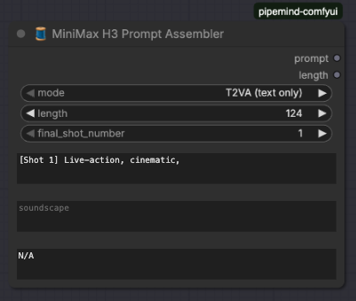
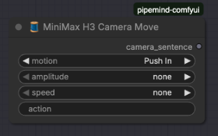
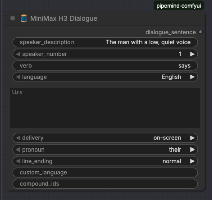
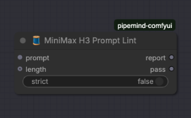
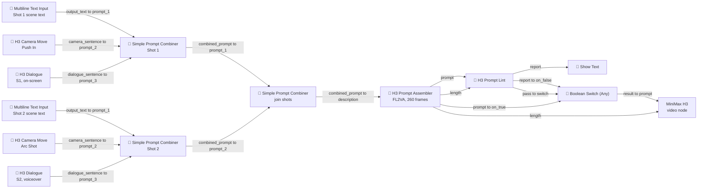

# 🧵 Pipemind ComfyUI Custom Nodes

A focused collection of custom nodes for ComfyUI, designed for efficient workflow management without the bloat of large node packs.

[](https://opensource.org/licenses/MIT)
[](https://www.python.org/downloads/)
[](https://github.com/aa-parky/pipemind-comfyui/actions/workflows/tests.yml)
[](https://github.com/aa-parky/pipemind-comfyui/actions/workflows/code-quality.yml)
[](https://codecov.io/gh/aa-parky/pipemind-comfyui)

## 📋 Table of Contents

- [Features](#features)
- [Installation](#installation)
- [Node Categories](#node-categories)
- [Using the MiniMax H3 Nodes](#-using-the-minimax-h3-nodes)
- [Requirements](#requirements)
- [Testing](#testing)
- [Contributing](#contributing)
- [License](#license)

## ✨ Features

- **Lightweight**: Minimal dependencies, focused functionality
- **Text Processing**: Advanced file reading and line selection
- **Prompt Tools**: Flexible prompt composition and combination
- **MiniMax H3 Prompting**: Structured prompt assembly, camera/dialogue tagging, and validation for H3 video generation
- **Resolution Helpers**: Aspect ratio presets for Flux, SDXL, and Qwen models
- **Image Batch Processing**: Efficient batch loading and saving
- **Debugging Tools**: Text display and any-type visualization
- **Utilities**: Boolean switches, token counters, LoRA loading

## 🚀 Installation

### Method 1: ComfyUI Manager (Recommended)

1. Install [ComfyUI Manager](https://github.com/ltdrdata/ComfyUI-Manager)
2. Search for "Pipemind" in the manager
3. Click Install

### Method 2: Manual Installation

```bash
cd ComfyUI/custom_nodes
git clone https://github.com/aa-parky/pipemind-comfyui.git
cd pipemind-comfyui
pip install -r requirements.txt
```

### Method 3: Git URL in ComfyUI Manager

```
https://github.com/aa-parky/pipemind-comfyui
```

## 📦 Node Categories

### 🔤 Text Processing & File I/O

#### 🧵 Random Line from File (Seeded)
**Node ID**: `RandomLineFromDropdown`
- Randomly selects a line from a text file with seed control
- Perfect for random prompt generation with reproducibility
- Supports custom file paths

#### 🧵 Select Line from TxT (Any)
**Node ID**: `SelectLineFromDropdown`
- Advanced line selection with multiple modes
- Supports line ranges, sequences, and filtering
- Includes search/find functionality
- Outputs selected line and preview

#### 🧵 Load TXT File
**Node ID**: `LoadTxtFile`
- Loads entire text file contents
- Returns as string for further processing

#### 🧵 Multiline Text Input
**Node ID**: `PipemindMultilineTextInput`
- Multi-line text input widget
- Useful for prompt templates and long-form text

---

### ✍️ Prompt Composition

#### 🧵 Keyword Prompt Composer
**Node ID**: `KeywordPromptComposer`
- Compose prompts from keyword categories
- Tag-based organization
- Supports inline tagging

#### 🧵 Enhanced Keyword Composer
**Node ID**: `EnhancedKeywordPromptComposer`
- Extended version of Keyword Composer
- Additional features and options
- More flexible composition modes

#### 🧵 Simple Prompt Combiner (5x)
**Node ID**: `SimplePromptCombiner`
- Combines up to 5 prompts with custom separators
- Clean, straightforward merging
- Optional whitespace handling

---

### 🎬 MiniMax H3 Prompting

Nodes for building well-structured [MiniMax H3](https://docs.comfy.org/tutorials/video/minimax/minimax-h3) audiovisual prompts in the model's preferred tagged format. The family owns the mechanical grammar (alignment lines, `[Shot N]` timestamps, `<d>[Language]` dialogue tags, camera vocabulary) so the prompt text can focus on the creative description.

> 📖 For a full walkthrough with screenshots and a worked workflow, see [Using the MiniMax H3 Nodes](#-using-the-minimax-h3-nodes).

#### 🧵 MiniMax H3 Prompt Assembler
**Node ID**: `PipemindH3PromptAssembler`
- Assembles complete base-mode prompts (T2VA / I2VA / FL2VA / L2VA)
- Generates the exact mode-specific alignment first line with the effective duration to two decimals
- Snaps frame counts to the model's 17n+5 grid (24 fps)
- `length` INT passthrough keeps the alignment line and the sampler duration in sync — wire it into the MiniMax H3 node's `length` input

#### 🧵 MiniMax H3 Camera Move
**Node ID**: `PipemindH3CameraMove`
- Builds camera sentences from the model's fixed motion vocabulary (Push In, Truck Left, Arc Shot, ...)
- Optional amplitude (small/large) and speed (slow/fast) qualifiers; defaults omit them, matching the guide
- Output fragment feeds the prompt combiners or a `<camera>` placeholder in the Keyword Composer

#### 🧵 MiniMax H3 Dialogue
**Node ID**: `PipemindH3Dialogue`
- Correctly tagged `<d>[Language] ...</d>` dialogue with stable `(S1)` speaker IDs and compound group IDs
- Voiceover mode emits the required "off-screen voiceover" phrase plus the closed-lips clause
- Supports `<cutoff>` (speech truncated by video end) and `<scenetrans>` (line crossing a cut) endings

#### 🧵 MiniMax H3 Prompt Lint
**Node ID**: `PipemindH3PromptLint`
- Validates field structure, shot numbering, cut timestamps, dialogue tags, speaker-ID ordering, and alignment-line/duration agreement
- Warns on description word count outside 350–500 and stray curly braces
- `pass` BOOLEAN output pairs with 🧵 Boolean Switch (Any) to gate queuing on a valid prompt

---

### 📐 Resolution & Aspect Ratios

#### 🧵 Flux 2M Aspect Ratios
**Node ID**: `PipemindFlux2MAspectRatio`
- Optimized presets for Flux.1 models
- Landscape/Portrait/Manual modes
- Presets: 1:1 (1408x1408), 3:2 (1728x1152), 4:3 (1664x1216), 16:9 (1920x1088), 21:9 (2176x960)

#### 🧵 SDXL Aspect Ratios
**Node ID**: `PipemindSDXL15AspectRatio`
- SDXL-optimized resolutions
- Multiple common aspect ratios
- Portrait orientation support

#### 🧵 Qwen Aspect Ratios
**Node ID**: `PipemindQwenAspectRatio`
- Official Qwen-Image resolutions
- Presets: 1:1 (1328x1328), 16:9 (1664x928), 4:3 (1472x1140), 3:2 (1584x1056)
- Landscape/Portrait modes with auto-swap

---

### 🖼️ Image Processing

#### 🧵 Batch Image Loader src Input
**Node ID**: `BatchImageLoadInput`
- Load images from directory as batch
- Source directory input mode
- Maintains batch structure

#### 🧵 Batch Image Loader src Output
**Node ID**: `BatchImageLoadOutput`
- Complementary output for batch processing
- Efficient batch handling
- Preserves image metadata

#### 🧵 Save Image with Caption
**Node ID**: `PipemindSaveImageWTxt`
- Saves images with accompanying text files
- Perfect for dataset creation
- Automatic caption file generation

---

### 🔍 Display & Debugging

#### 🧵 Show Text
**Node ID**: `PipemindShowText`
- Display text values in the UI
- Simple text visualization
- Useful for debugging workflows

#### 🧵 Show Text Find
**Node ID**: `PipemindShowTextFind`
- Text display with search functionality
- Highlight matching patterns
- Regex support

#### 🧵 Display Any
**Node ID**: `PipemindDisplayAny`
- Display any data type
- Universal debugging node
- Automatic type detection and formatting

---

### 🛠️ Utilities

#### 🧵 Boolean Switch (Any)
**Node ID**: `BooleanSwitchAny`
- Route any data type based on boolean condition
- Visual feedback (color changes on state)
- Essential for conditional workflows

#### 🧵 Token Counter
**Node ID**: `PipemindTokenCounter`
- Count tokens in text using HuggingFace tokenizers
- Supports multiple tokenizer models
- Returns token count as integer

#### 🧵 LoRA Loader
**Node ID**: `PipemindLoraLoader`
- Load LoRA models into your workflow
- Standard LoRA loading interface
- Compatible with ComfyUI model management

---

## 🎬 Using the MiniMax H3 Nodes

MiniMax H3 is a **jointly audiovisual** model: one prompt produces the picture *and* the sound. Its prompt format is unusually mechanical — three labelled fields, a mode-specific alignment first line, `[Shot N]` headers with `At MM:SS.mmm` cut timestamps, `<d>[Language] ...</d>` dialogue blocks, and a fixed camera-motion vocabulary. Get any of that wrong and the model quietly produces something plausible but wrong rather than erroring.

These four nodes own that mechanical layer. You write the creative description; the nodes emit the grammar and then check it.

### The four nodes

#### 1. 🧵 MiniMax H3 Prompt Assembler



The centrepiece. It wraps your text in the three required fields, prepends the correct alignment line for the chosen mode, and snaps the frame count onto the model's valid grid.

| Widget | Type | Notes |
| --- | --- | --- |
| `mode` | dropdown | `T2VA (text only)`, `I2VA (first frame)`, `FL2VA (first + last frame)`, `L2VA (last frame)` |
| `length` | INT | Frames at 24 fps. Default `124`, range `5`–`3600`, step `17` |
| `final_shot_number` | INT | Which `[Shot N]` the *last* reference picture belongs to (used by `FL2VA` / `L2VA`) |
| `description` | multiline | The main body. Defaults to `[Shot 1] Live-action, cinematic, ` |
| `soundscape` | multiline | Diegetic audio. Leaving it blank wastes half the model |
| `music` | multiline | Non-diegetic score. `N/A` when there is none |

| Output | Type | Purpose |
| --- | --- | --- |
| `prompt` | STRING | The finished, fully-formatted H3 prompt |
| `length` | INT | The **snapped** frame count — wire this to the sampler |

**Frame counts live on a 17n+5 grid.** Valid values are 5, 22, 39, 56, … 124, … 260. Anything else is snapped *up*: enter `240` and you get `243`. Because the alignment line quotes the duration to two decimals, the snap has to happen before the line is written — which is exactly why the node returns `length` as an output rather than letting you set it twice.

**Only `T2VA` omits the alignment line.** The other three modes each get their own first line, and the bracketing genuinely differs between them (`FL2VA` uses bare `Picture 1` / `Shot N`; `I2VA` and `L2VA` use `<Picture 1>` / `[Shot N]`). That asymmetry comes from the official guide and is reproduced deliberately.

#### 2. 🧵 MiniMax H3 Camera Move



The H3 guide specifies a closed vocabulary of camera motions, each written as a natural action inside the shot rather than as a bare label. This node emits a correct sentence from that vocabulary, so the phrasing matches what the guide documents instead of being improvised.

| Widget | Type | Notes |
| --- | --- | --- |
| `motion` | dropdown | 20 terms: Static Shot, Push In, Pull Out, Zoom In/Out, Pan Left/Right, Truck Left/Right, Tilt Up/Down, Pedestal Up/Down, Arc Shot, Tracking Shot, Shake Slightly/Strongly, Roll Clockwise/Counterclockwise, POV |
| `amplitude` | dropdown | `none` / `small` / `large` |
| `speed` | dropdown | `none` / `slow` / `fast` |
| `action` | STRING (optional) | Continues the sentence as `as <action>` |

Output: `camera_sentence` (STRING).

**Both qualifiers default to `none` on purpose.** In the H3 grammar, medium amplitude and normal speed are expressed by *omission* — writing them out makes the sentence noisier without changing the result. Reach for `small`/`large` and `slow`/`fast` only when you actually want to depart from the default.

```
motion    = Push In
amplitude = small
speed     = slow
action    = he unfolds the letter
→ The camera pushes in with small amplitude at slow speed as he unfolds the letter.
```

#### 3. 🧵 MiniMax H3 Dialogue



Speech is where H3 prompts most often go wrong, because the delivery description must sit **outside** the `<d>` tag while only the language marker and the literal words go inside.

| Widget | Type | Notes |
| --- | --- | --- |
| `speaker_description` | STRING | Identity *and* delivery — stays outside the tag |
| `speaker_number` | INT | 1–9, becomes `(S1)`, `(S2)`, … |
| `verb` | STRING | `says`, `whispers`, `answers`, … |
| `language` | dropdown | 12 languages plus `custom` |
| `line` | multiline | The literal words spoken; punctuation is preserved |
| `delivery` | dropdown | `on-screen` or `off-screen voiceover` |
| `pronoun` | dropdown | `their` / `his` / `her`, used by the voiceover and scene-transition clauses |
| `line_ending` | dropdown | `normal`, `cutoff (video ends mid-line)`, `scenetrans (line continues after a cut)`, `scenetrans (line carried over from previous shot)` |
| `custom_language` | STRING (optional) | Used when `language` is `custom` |
| `compound_ids` | STRING (optional) | Overrides `speaker_number` for group speech, e.g. `S1,S2` |

Output: `dialogue_sentence` (STRING).

**Speaker IDs must be assigned in order of first vocal event** — whoever speaks first is `S1`. The lint node checks this, because getting it wrong reassigns voices across the whole clip.

**Voiceover needs the closed-lips clause.** Selecting `off-screen voiceover` emits the fixed phrase *and* appends "while their lips remain completely closed". Without it a jointly-generated model will animate a talking mouth underneath the narration:

```
The woman by the window (S2) answers in an off-screen voiceover:
<d>[English] Then we stop looking <cutoff></d> while her lips remain completely closed.
```

#### 4. 🧵 MiniMax H3 Prompt Lint



The safety net. Note that `prompt` and `length` are **inputs, not widgets** — they are meant to be wired straight from the Assembler's two outputs.

| Input | Type | Notes |
| --- | --- | --- |
| `prompt` | STRING (link) | From the Assembler's `prompt` output |
| `strict` | BOOLEAN widget | When `true`, warnings fail as well as errors |
| `length` | INT (link, optional) | From the Assembler's `length` output — enables the duration checks |

| Output | Type | Purpose |
| --- | --- | --- |
| `report` | STRING | Human-readable findings |
| `pass` | BOOLEAN | `true` when there are no errors (and, under `strict`, no warnings) |

**Errors** (structural — the prompt is malformed):

- a required field label missing or duplicated
- a timestamp on `[Shot 1]`, or a shot after `[Shot 1]` *without* a valid `At MM:SS.mmm` timestamp
- shot numbers out of sequence, or cut timestamps not strictly increasing
- a timestamp at or beyond the video duration
- a `<d>` block missing its leading `[Language]` tag, or unbalanced `<d>` / `</d>`
- speaker IDs whose first appearances are out of numeric order
- an alignment-line duration that disagrees with the wired `length`
- `<cutoff>` outside the final dialogue block, or appearing more than once

**Warnings** (advisory):

- description outside the 350–500 word range the model expects for generation
- curly braces, which ComfyUI's `dynamic_prompts` parsing would consume
- an empty `overall_soundscape`

**Wire `length` in.** Without it the duration checks are skipped, and the single most common silent H3 failure is a nominal-vs-aligned duration mismatch:

```
H3 prompt lint: 1 error(s), 2 warning(s)
ERROR: alignment line ends at 10.12s but length=200 frames gives 8.33s
WARN: overall_soundscape is empty; H3 generates audio jointly, so an empty soundscape wastes half the model (use 'N/A' only for deliberate total silence)
WARN: description is 104 words; the model expects 350-500 for generation tasks
```

---

### A complete worked workflow

A two-shot, two-speaker `FL2VA` clip at 260 frames (10.83 s), with the prompt gated on a clean lint.

#### Graph



#### Connection table

| From | Output | To | Input |
| --- | --- | --- | --- |
| Multiline Text Input (Shot 1) | `output_text` | Simple Prompt Combiner A | `prompt_1` |
| H3 Camera Move #1 | `camera_sentence` | Simple Prompt Combiner A | `prompt_2` |
| H3 Dialogue #1 | `dialogue_sentence` | Simple Prompt Combiner A | `prompt_3` |
| Multiline Text Input (Shot 2) | `output_text` | Simple Prompt Combiner B | `prompt_1` |
| H3 Camera Move #2 | `camera_sentence` | Simple Prompt Combiner B | `prompt_2` |
| H3 Dialogue #2 | `dialogue_sentence` | Simple Prompt Combiner B | `prompt_3` |
| Simple Prompt Combiner A | `combined_prompt` | Simple Prompt Combiner C | `prompt_1` |
| Simple Prompt Combiner B | `combined_prompt` | Simple Prompt Combiner C | `prompt_2` |
| Simple Prompt Combiner C | `combined_prompt` | H3 Prompt Assembler | `description` ※ |
| H3 Prompt Assembler | `prompt` | H3 Prompt Lint | `prompt` |
| H3 Prompt Assembler | `length` | H3 Prompt Lint | `length` |
| H3 Prompt Assembler | `prompt` | Boolean Switch (Any) | `on_true` |
| H3 Prompt Lint | `report` | Boolean Switch (Any) | `on_false` |
| H3 Prompt Lint | `report` | Show Text | `text` |
| H3 Prompt Lint | `pass` | Boolean Switch (Any) | `switch` ※ |
| Boolean Switch (Any) | `result` | MiniMax H3 (video node) | `prompt` |
| H3 Prompt Assembler | `length` | MiniMax H3 (video node) | `length` |

※ `description` and `switch` are widgets by default. Convert each to an input first — right-click the node → **Convert widget to input**, or on newer ComfyUI frontends simply drag a link onto the widget.

All three combiners use `delimiter = space`.

Because this example is `FL2VA`, the MiniMax H3 video node also needs its two reference images wired — one for the first frame (`[Shot 1]`) and one for the last (`[Shot 2]`, matching `final_shot_number`). `T2VA` needs none; `I2VA` and `L2VA` need one each. Those inputs belong to ComfyUI's own H3 node, so the exact socket names depend on your ComfyUI version.

#### Node settings

- **Camera Move #1** — `motion: Push In`, `amplitude: small`, `speed: slow`, `action: he unfolds the letter`
- **Camera Move #2** — `motion: Arc Shot`, `amplitude: none`, `speed: none`, `action:` *(blank)*
- **Dialogue #1** — `speaker_description: The man with a low, quiet voice`, `speaker_number: 1`, `verb: says`, `language: English`, `line: They never found the second key`, `delivery: on-screen`, `pronoun: his`, `line_ending: normal`
- **Dialogue #2** — `speaker_description: The woman by the window`, `speaker_number: 2`, `verb: answers`, `language: English`, `line: Then we stop looking`, `delivery: off-screen voiceover`, `pronoun: her`, `line_ending: cutoff (video ends mid-line)`

**Multiline Text Input (Shot 1)** — leave `enable_dynamic` off and replace the default text:

```
[Shot 1] Live-action, cinematic, a cramped attic study at dusk, warm tungsten
light raking across dust. A man in his sixties sits at a desk covered in
unopened envelopes.
```

**Multiline Text Input (Shot 2)** — note the mandatory timestamp on every shot after the first:

```
[Shot 2] At 00:05.500 The same attic, wider. A woman stands silhouetted
against the window.
```

> ⚠️ The Multiline Text Input node ships with a `{a|b}` wildcard example as its default text. Clear it — the lint node warns about curly braces, because ComfyUI's `dynamic_prompts` parsing will eat them if the text is ever pasted into a prompt widget.

**Prompt Assembler** — `mode: FL2VA (first + last frame)`, `length: 260`, `final_shot_number: 2`, `soundscape:`

```
Room tone with a faint street hum through single glazing; paper rustle on the
letter; a chair creak on the arc.
```

`music: N/A`. `description` arrives over the link from Combiner C.

**Prompt Lint** — `strict: false`.

#### What comes out

The Assembler's `prompt` output:

```
How the reference pictures align with the target video — Picture 1 (from Shot 1) aligns with the 0.00-second mark of the target video; Picture 2 (from Shot 2) aligns with the 10.83-second mark of the target video.

integrated_multimodal_description: [Shot 1] Live-action, cinematic, a cramped attic study at dusk, warm tungsten light raking across dust. A man in his sixties sits at a desk covered in unopened envelopes. The camera pushes in with small amplitude at slow speed as he unfolds the letter. The man with a low, quiet voice (S1) says: <d>[English] They never found the second key.</d> [Shot 2] At 00:05.500 The same attic, wider. A woman stands silhouetted against the window. The camera arcs around the subject. The woman by the window (S2) answers in an off-screen voiceover: <d>[English] Then we stop looking <cutoff></d> while her lips remain completely closed.

overall_soundscape: Room tone with a faint street hum through single glazing; paper rustle on the letter; a chair creak on the arc.

non_diegetic_music: N/A
```

The Lint node's `report`, shown in Show Text:

```
H3 prompt lint: 0 error(s), 1 warning(s)
WARN: description is 104 words; the model expects 350-500 for generation tasks
```

`pass` is `true` — there are no errors — so the Boolean Switch forwards the prompt. Expanding the description toward 350–500 words clears the remaining warning.

#### How the gate behaves

`Boolean Switch (Any)` requires **both** `on_true` and `on_false` to be connected, which is why `report` goes into `on_false`. On a clean lint the switch forwards the prompt; on a failing one it forwards the error report instead. The H3 node then generates from the lint report — visibly nonsense, which is the point: you notice immediately rather than shipping a subtly wrong render.

If you would rather nothing reach the sampler at all, drop the switch and route the Assembler's `prompt` straight to the H3 node, keeping the Lint → Show Text branch as a manual pre-flight check that you read before queuing.

Set `strict: true` on the Lint node to make warnings fail too — worth doing once the description is at full length.

---

### Mode reference

| Mode | Reference images | Alignment line |
| --- | --- | --- |
| `T2VA` | none | *(none — the prompt starts at the description field)* |
| `I2VA` | first frame | `... at 0.00 seconds ..., <Picture 1> (from [Shot 1]) is fully referenced.` |
| `FL2VA` | first + last frame | `Picture 1 (from Shot 1)` at `0.00`, `Picture 2 (from Shot N)` at the clip duration |
| `L2VA` | last frame | `<Picture 1> (from [Shot N])` at the clip duration |

Set `final_shot_number` to the shot the closing reference image belongs to. For a single-shot clip that is `1`; in the worked example above, `[Shot 2]` is the last shot, so it is `2`.

### Common mistakes the nodes prevent

| Mistake | What catches it |
| --- | --- |
| Nominal duration (10.00 s) disagreeing with the snapped frame count (10.83 s) | Assembler's `length` passthrough + Lint's alignment check |
| A timestamp on `[Shot 1]` | Lint error |
| `[Shot 2]` without `At MM:SS.mmm` | Lint error |
| A cut timestamp past the end of the clip | Lint error (needs `length` wired) |
| Delivery description written *inside* the `<d>` tag | Dialogue node builds the sentence for you |
| Voiceover without the closed-lips clause | Dialogue node's `off-screen voiceover` mode |
| `S2` speaking before `S1` | Lint error on speaker-ID ordering |
| Camera phrasing outside the guide's vocabulary | Camera Move's fixed dropdown |
| Empty soundscape on a jointly audiovisual model | Lint warning |

## 📋 Requirements

- **Python**: 3.12.12+ (recommended for PyTorch CUDA compatibility)
- **ComfyUI**: Latest version
- **Dependencies**:
  - Pillow >= 10.0.0
  - transformers >= 4.30.0
  - PyTorch (provided by ComfyUI)
  - NumPy (provided by ComfyUI)

## 🧪 Testing

This project includes a comprehensive test suite to ensure reliability and quality.

### Running Tests

```bash
# Install development dependencies
pip install -r requirements-dev.txt

# Run all tests
pytest

# Run with coverage report
pytest --cov=. --cov-report=html

# Run specific test categories
pytest -m unit        # Unit tests only
pytest -m smoke       # Quick smoke tests
pytest -m aspect_ratio # Aspect ratio node tests
```

### Test Categories

Tests are organized using markers:
- `unit` - Unit tests for individual functions
- `integration` - Integration tests with ComfyUI
- `smoke` - Quick validation tests
- `slow` - Longer-running tests
- Category-specific: `aspect_ratio`, `text`, `image`, `prompt`, `utility`

For detailed testing documentation, see [tests/README.md](tests/README.md).

## 🤝 Contributing

Contributions are welcome! Please see [CONTRIBUTING.md](CONTRIBUTING.md) for guidelines.

### Development Setup

```bash
# Clone the repository
git clone https://github.com/aa-parky/pipemind-comfyui.git
cd pipemind-comfyui

# Create a development branch
git checkout -b feature/your-feature-name

# Install dependencies
pip install -r requirements.txt

# Make your changes and commit
git add .
git commit -m "Description of changes"
git push origin feature/your-feature-name
```

## 📝 License

This project is licensed under the MIT License - see the [LICENSE](LICENSE) file for details.

## 🙏 Acknowledgments

- Built for the [ComfyUI](https://github.com/comfyanonymous/ComfyUI) community
- Inspired by the need for lightweight, focused node collections

## 📞 Support

- **Issues**: [GitHub Issues](https://github.com/aa-parky/pipemind-comfyui/issues)
- **Discussions**: [GitHub Discussions](https://github.com/aa-parky/pipemind-comfyui/discussions)

---

**Note**: All nodes are prefixed with 🧵 in the ComfyUI interface for easy identification.
